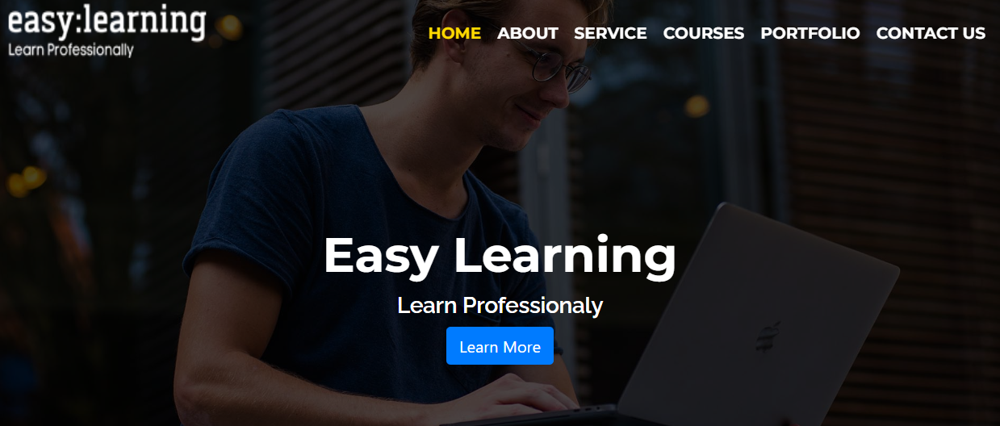

# EasyLearning Landing Page Project

This project is a landing page for EasyLearning, an online course company that teaches Ecommerce, web design, and web development.

## Technologies Used

This project was built using the following technologies:

- HTML
- CSS
- React JS

## Project Setup

To get started with this project, follow these steps:

1. Clone the repository to your local machine
2. Run `npm install` to install the required dependencies
3. Run `npm start` to start the development server
4. Open your web browser and navigate to `http://localhost:3000`

## Features

This landing page features the following sections:

### Home

The `Home` section welcomes users to the site and provides an overview of EasyLearning's offerings.

### About

The `About` section provides information about the company's mission, history, and team.

### Services

The `Services` section outlines the various services that EasyLearning provides.

### Courses

The `Courses` section provides an overview of the different courses that users can enroll in.

### Portfolio

The `Portfolio` section showcases EasyLearning's previous work and projects.

### Contact Us

The `Contact Us` section provides users with a form to contact the company directly.

## Credits
The React JS portion of this project was inspired by the [React with Laravel course](https://www.udemy.com/course/react-with-laravel-build-complete-project/) on Udemy.

## Contributing

If you would like to contribute to this project, please submit a pull request or contact us at `dev@easylearning.com`.

## Support

If you have any questions or issues with this project, please reach out to us via email at `support@easylearning.com`.

Happy coding!
